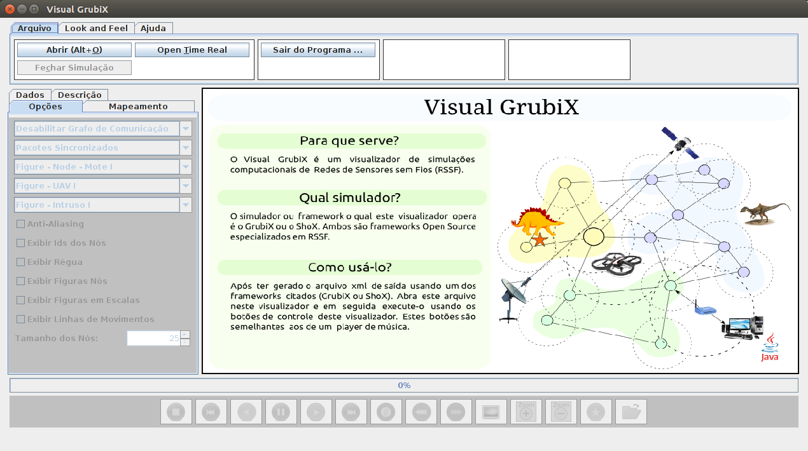
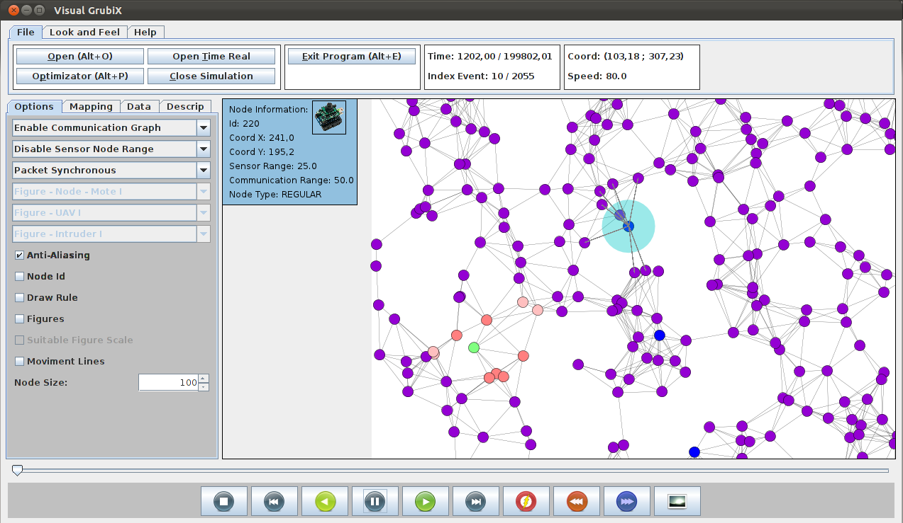

# VisualGrubix

Visualizador de simulações computacionais do Framework Grubix para Redes de Sensores Sem Fio (RSSF).

Desenvolvedor: Jesimar da Silva Arantes

Para mais informações acesse os materiais: 

[TCC sobre o VisualGrubix](./manuais/TCC-Jesimar-SI-UFLA-VisualGrubix.pdf)

[Manual do Grubix](./manuais/ManualGrubix.pdf)

[Manual do VisualGrubix](./manuais/ManualVisualizador.pdf)
